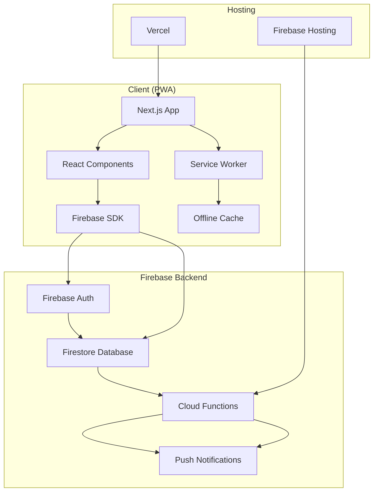
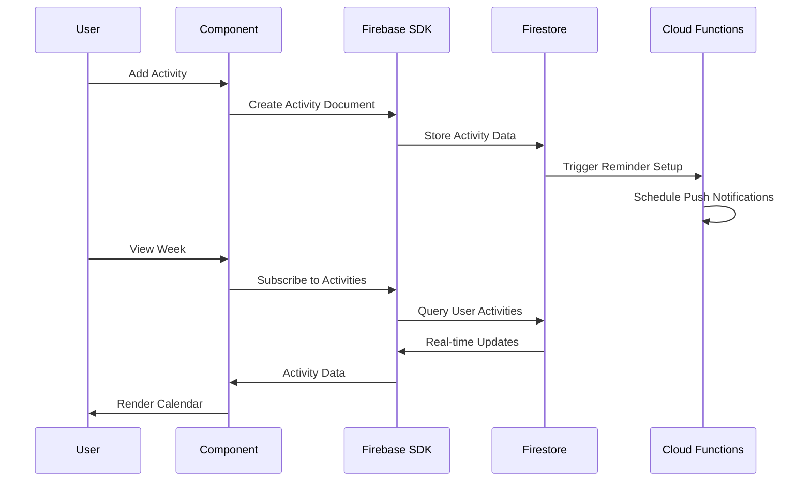

# Design Document

## Overview

The Kids Activity Scheduler is a PWA built with Next.js that provides parents with an intuitive interface to manage their children's recurring activities. The application leverages Firebase for authentication and data storage, with Vercel hosting the frontend and Firebase Cloud Functions handling automated reminders.

The design emphasizes mobile-first responsive UI, offline capabilities, and fast loading through Next.js optimization. The system uses a simple but effective data model with three core entities: Users, Children, and Activities, with computed occurrences for schedule display.

## Architecture

### High-Level Architecture



### Technology Stack

- **Frontend**: Next.js 14+ with TypeScript, Tailwind CSS, shadcn/ui components
- **Authentication**: Firebase Auth (email/password + Google OAuth)
- **Database**: Firestore with real-time subscriptions
- **Functions**: Firebase Cloud Functions for reminder scheduling
- **Hosting**: Vercel for frontend, Firebase for backend services
- **PWA**: Service Worker with offline caching strategy

## Components and Interfaces

### Core Components

#### Authentication Layer
- `AuthProvider`: Context provider managing authentication state
- `LoginForm`: Email/password and Google OAuth login interface
- `ProtectedRoute`: Route wrapper ensuring authenticated access

#### Child Management
- `ChildList`: Display and manage child profiles
- `ChildForm`: Add/edit child with name and color selection
- `ChildCard`: Individual child display component with color theming

#### Activity Management
- `ActivityForm`: Comprehensive form for activity creation/editing
  - Child selection dropdown
  - Activity name and location inputs
  - Day-of-week multi-select (checkboxes for Mon-Sun)
  - Time pickers for start/end times
  - Timezone handling
- `ActivityList`: List view of all activities with edit/delete actions

#### Calendar Views
- `WeekView`: Primary calendar interface
  - 7-day grid layout
  - Activity blocks positioned by time
  - Color-coded by child
  - Navigation controls for week switching
- `DayView`: Optional detailed single-day view
- `ActivityBlock`: Individual activity display within calendar views

#### Notification System
- `NotificationSettings`: User preferences for reminder timing
- `NotificationPermission`: Request and manage browser notification permissions

### Data Flow Architecture



## Data Models

### Firestore Collections Structure

#### Users Collection
```typescript
interface User {
  userId: string;          // Firebase Auth UID
  email: string;           // User email
  createdAt: Timestamp;    // Account creation date
  notificationSettings: {
    oneHour: boolean;      // 1-hour reminder preference
    thirtyMinutes: boolean; // 30-minute reminder preference
  };
}
```

#### Children Collection
```typescript
interface Child {
  childId: string;         // Auto-generated document ID
  userId: string;          // Parent user reference
  name: string;            // Child's name
  color: string;           // Hex color code for UI theming
  createdAt: Timestamp;    // Profile creation date
}
```

#### Activities Collection
```typescript
interface Activity {
  activityId: string;      // Auto-generated document ID
  userId: string;          // Parent user reference
  childId: string;         // Associated child reference
  title: string;           // Activity name
  location: string;        // Activity location (text)
  daysOfWeek: number[];    // Array of day numbers (1=Monday, 7=Sunday)
  startTime: string;       // Time in HH:MM format
  endTime: string;         // Time in HH:MM format
  timezone: string;        // User's timezone (e.g., "America/New_York")
  createdAt: Timestamp;    // Activity creation date
}
```

### Computed Data Models

#### Activity Occurrences (Client-side)
```typescript
interface ActivityOccurrence {
  activityId: string;      // Reference to parent activity
  date: Date;              // Specific occurrence date
  startDateTime: Date;     // Full start date/time
  endDateTime: Date;       // Full end date/time
  title: string;           // Activity title
  location: string;        // Activity location
  childName: string;       // Child's name
  childColor: string;      // Child's color for display
}
```

### Database Security Rules

```javascript
// Firestore Security Rules
rules_version = '2';
service cloud.firestore {
  match /databases/{database}/documents {
    // Users can only access their own data
    match /users/{userId} {
      allow read, write: if request.auth != null && request.auth.uid == userId;
    }
    
    // Children belong to authenticated users
    match /children/{childId} {
      allow read, write: if request.auth != null && 
        request.auth.uid == resource.data.userId;
    }
    
    // Activities belong to authenticated users
    match /activities/{activityId} {
      allow read, write: if request.auth != null && 
        request.auth.uid == resource.data.userId;
    }
  }
}
```

## Error Handling

### Client-Side Error Handling

#### Authentication Errors
- Invalid credentials: Display user-friendly error messages
- Network connectivity: Offline mode with cached data
- Session expiration: Automatic redirect to login with state preservation

#### Data Operation Errors
- Firestore write failures: Retry mechanism with exponential backoff
- Validation errors: Real-time form validation with clear error messages
- Network timeouts: Graceful degradation to cached data

#### PWA-Specific Errors
- Service worker registration failures: Fallback to standard web app
- Cache storage errors: Clear corrupted cache and reload
- Notification permission denied: Graceful handling with alternative reminders

### Error Boundary Implementation
```typescript
class ActivitySchedulerErrorBoundary extends React.Component {
  // Catch JavaScript errors in component tree
  // Log errors to Firebase Analytics
  // Display fallback UI with recovery options
}
```

### Backend Error Handling

#### Cloud Functions Error Handling
- Notification delivery failures: Retry with exponential backoff
- Database connection errors: Circuit breaker pattern
- Timezone calculation errors: Fallback to UTC with user notification

## Testing Strategy

### Unit Testing
- **Component Testing**: React Testing Library for UI components
- **Utility Functions**: Jest for date/time calculations and data transformations
- **Firebase Integration**: Mock Firebase SDK for isolated testing

### Integration Testing
- **Authentication Flow**: End-to-end login/logout scenarios
- **Data Persistence**: Firestore read/write operations
- **Real-time Updates**: Firestore subscription handling

### PWA Testing
- **Service Worker**: Cache strategies and offline functionality
- **Installation**: Add to home screen across different browsers
- **Performance**: Lighthouse audits for PWA compliance

### User Acceptance Testing
- **Mobile Responsiveness**: Testing across iOS Safari, Chrome Android
- **Notification Delivery**: Push notification timing and content
- **Offline Functionality**: Data access without network connectivity

### Testing Environment Setup
- **Development**: Firebase Emulator Suite for local testing
- **Staging**: Separate Firebase project for pre-production testing
- **Production**: Monitoring with Firebase Analytics and Crashlytics

## Performance Considerations

### Frontend Optimization
- Next.js static generation for landing pages
- Dynamic imports for code splitting
- Image optimization with Next.js Image component
- Tailwind CSS purging for minimal bundle size

### Database Optimization
- Firestore composite indexes for efficient queries
- Real-time listener optimization to minimize reads
- Client-side caching with React Query or SWR

### PWA Performance
- Service worker caching strategy for static assets
- Background sync for offline data synchronization
- Push notification batching to reduce server load